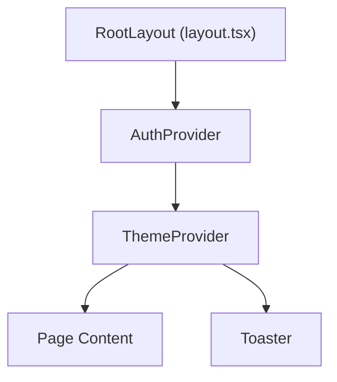
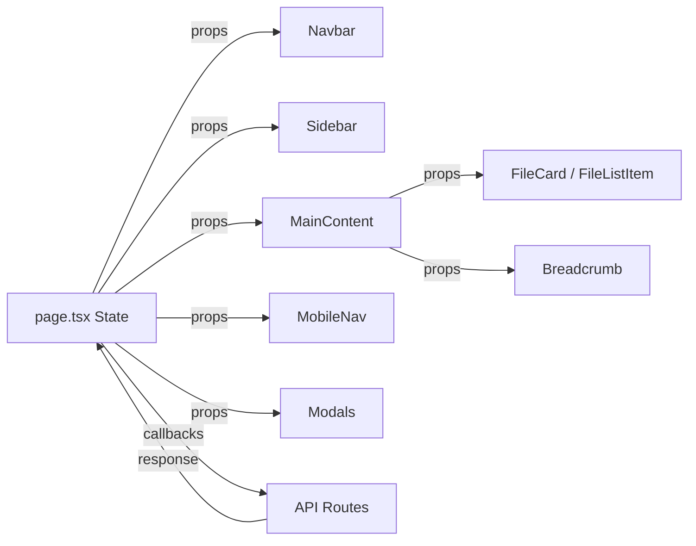
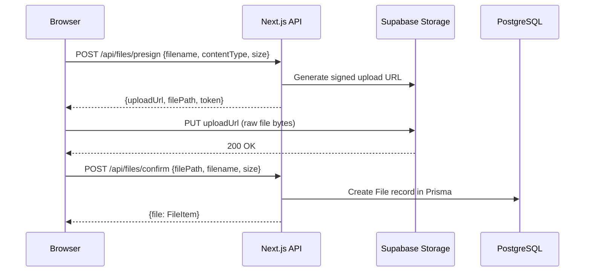

# CloudDrive — Complete Frontend Documentation

This document is a comprehensive technical reference for the **CloudDrive** frontend. It covers the full architecture, design system, component tree, state management patterns, API integration layer, theming infrastructure, and every interactive feature from file uploads to AI summarization.

---

## 🏗️ Architecture & Technology Stack

CloudDrive is a monolithic **Next.js 14 App Router** application where the frontend and backend API routes coexist in a single deployable unit. The frontend renders entirely client-side (`"use client"`) and communicates with co-located API route handlers under `src/app/api/`.

| Layer | Technology | Purpose |
|---|---|---|
| **Framework** | Next.js 14 (App Router) | File-based routing, API routes, SSR shell |
| **Language** | TypeScript | End-to-end type safety |
| **Styling** | Tailwind CSS 3.4 + Custom CSS Design System | Utility classes + enterprise-grade token system |
| **Typography** | Inter (Google Fonts) | Modern sans-serif loaded via `@import` in globals.css |
| **Animations** | Framer Motion + CSS keyframes | Modal transitions, page entrances, micro-interactions |
| **Icons** | Lucide React | Consistent, tree-shakeable icon library |
| **State** | React `useState` / `useCallback` / `useEffect` | Local component state, no external store |
| **Auth** | NextAuth (session) + JWT (localStorage) | Dual auth strategy for SSR and client-side calls |
| **Toasts** | React Hot Toast | Bottom-right notification system with themed styling |
| **Code Editor** | Monaco Editor (`@monaco-editor/react`) | In-browser code editing for `.py`, `.txt`, `.md`, `.json` |
| **File Handling** | React Dropzone | Drag-and-drop file upload zones |
| **ZIP** | JSZip | Client-side ZIP creation for batch downloads |
| **Storage** | Supabase Storage (via presigned URLs) | Direct browser-to-storage uploads bypassing Vercel's 4.5MB limit |
| **AI** | Groq SDK (server-side) | AI summaries, tag extraction, semantic search |
| **Validation** | Zod | Schema validation for API inputs |
| **Logging** | Winston | Structured server-side logging |

---

## 📂 Source Code Map

```text
src/
├── app/
│   ├── globals.css              # Complete design system (1238 lines)
│   ├── layout.tsx               # Root layout: AuthProvider → ThemeProvider → Toaster
│   ├── page.tsx                 # Main dashboard (1182 lines) — the entire authenticated experience
│   ├── login/
│   │   └── page.tsx             # Login & registration page
│   ├── share/
│   │   └── [id]/
│   │       └── page.tsx         # Public shared-file viewer
│   └── api/                     # Backend API routes (co-located)
│       ├── auth/                # register, login, me, [...nextauth]
│       ├── files/               # CRUD, presign, confirm, trash, content, download, share, summarize
│       ├── folders/             # Folder creation
│       ├── share/               # Public share access
│       ├── storage/             # Usage statistics
│       ├── ai/                  # AI search endpoint
│       ├── summarize/           # Local file summarization
│       └── drop-links/          # File-drop link management
├── components/
│   ├── files/                   # File display components
│   │   ├── EmptyState.tsx       # Context-aware empty states for each folder view
│   │   ├── FileCard.tsx         # Grid-mode file card with context menu
│   │   ├── FileDetailsPanel.tsx # Slide-out details panel (metadata, actions, AI summary)
│   │   ├── FileListItem.tsx     # List-mode file row with context menu
│   │   ├── FileSkeletons.tsx    # Loading skeleton placeholders
│   │   └── ZipDownloadButton.tsx # Multi-select ZIP download FAB
│   ├── layout/                  # Shell layout components
│   │   ├── MainContent.tsx      # Central content area (toolbar, breadcrumbs, file grid/list)
│   │   ├── MobileNav.tsx        # Bottom tab navigation for mobile
│   │   ├── Navbar.tsx           # Top navigation bar (search, upload, profile, theme, help, settings)
│   │   └── Sidebar.tsx          # Left sidebar (folder nav, storage meter, quick actions)
│   ├── modals/                  # 16 modal dialogs
│   │   ├── AvatarUploadModal    # Profile picture upload with crop preview
│   │   ├── CreateFileModal      # Create new .py/.txt/.md/.json files
│   │   ├── CreateFolderModal    # New folder dialog
│   │   ├── DuplicateFileModal   # Replace / Rename / Skip duplicate handling
│   │   ├── EditorModal          # Monaco + textarea inline editor
│   │   ├── HelpModal            # Sidebar help panel (keyboard shortcuts, tips)
│   │   ├── NavHelpModal         # Navbar help variant
│   │   ├── NavProfileModal      # Navbar profile dropdown
│   │   ├── NavSettingsModal      # Navbar settings panel
│   │   ├── PreviewModal         # File preview (images, PDFs, video, audio, text)
│   │   ├── ProfileModal         # Full profile management (avatar, name, email, password)
│   │   ├── QuickSummarizerModal # AI summary for local/browser files
│   │   ├── SettingsModal        # Sidebar settings (view mode, confirmations, theme)
│   │   ├── ShareModal           # Share with users + public link + file-drop links
│   │   ├── SummaryModal         # View/regenerate AI summary for uploaded files
│   │   └── UploadModal          # Drag-and-drop upload dialog
│   ├── providers/
│   │   ├── AuthProvider.tsx     # NextAuth SessionProvider wrapper
│   │   └── ThemeProvider.tsx    # Light/Dark/System theme context with transitions
│   └── ui/                      # Reusable primitives
│       ├── Breadcrumb.tsx       # Folder hierarchy breadcrumb trail
│       ├── CommandPalette.tsx   # ⌘K command palette with fuzzy search
│       ├── Tooltip.tsx          # Hover tooltip component
│       └── UploadStatusPanel.tsx # Floating upload progress tracker
├── lib/                         # Shared utilities
│   ├── auth.ts                  # JWT sign/verify, password hashing
│   ├── auth-options.ts          # NextAuth configuration
│   ├── errors.ts                # Typed error classes (NotFoundError, AuthError, etc.)
│   ├── groq.ts                  # Groq AI client initialization
│   ├── logger.ts                # Winston logger setup
│   ├── mockData.ts              # Fallback mock file data
│   ├── prisma.ts                # Prisma client singleton
│   ├── s3.ts                    # S3-compatible storage client (Supabase)
│   ├── supabase.ts              # Supabase client helpers
│   ├── utils.ts                 # File type detection, editable-file checks, formatting
│   └── validation.ts            # Zod schemas for API request validation
├── middleware/
│   ├── auth.middleware.ts       # JWT verification middleware for API routes
│   ├── error.middleware.ts      # Centralized error handler
│   └── rateLimit.middleware.ts  # In-memory rate limiter
├── repositories/
│   ├── file.repository.ts       # Prisma file queries (CRUD, search, folder tree)
│   └── user.repository.ts       # Prisma user queries
├── services/
│   ├── auth.service.ts          # Registration, login, profile update logic
│   └── file.service.ts          # Upload, delete, rename, star, trash, share orchestration
└── types/
    ├── index.ts                 # FileItem, ViewMode, User, Notification, StorageInfo
    └── next-auth.d.ts           # NextAuth session type augmentation
```

---

## 🎨 Design System

The design system is defined entirely in [globals.css](file:///c:/Users/acer/Google%20Drive%20Clone/cloud-drive/src/app/globals.css) (1238 lines) and [tailwind.config.ts](file:///c:/Users/acer/Google%20Drive%20Clone/cloud-drive/tailwind.config.ts). It follows an **enterprise-grade SaaS** aesthetic with an 8-point grid, WCAG AA compliance, and container queries.

### Design Tokens

#### Surface Palette (Light → Dark)
| Token | Light RGB | Dark RGB | Usage |
|---|---|---|---|
| `--surface-0` | `255 255 255` | `10 10 11` | Cards, inputs, modals |
| `--surface-50` | `249 250 251` | `17 17 19` | Page background |
| `--surface-100` | `243 244 246` | `21 21 24` | Muted backgrounds, insets |
| `--surface-200` | `229 231 235` | `31 31 35` | Borders, dividers |
| `--surface-500` | `107 114 128` | `161 161 170` | Muted text, placeholders |
| `--surface-900` | `17 24 39` | `250 250 250` | Primary text, headings |

#### Primary Color (Indigo)
| Token | Value | Usage |
|---|---|---|
| `--primary-500` | `99 102 241` (Indigo) | Buttons, focus rings, selections |
| `--primary-600` | `79 70 229` | Hover states |
| `--primary-400` | `129 140 248` (light) / `139 92 246` (dark) | Accents in dark mode |

#### Semantic Colors
| Status | Light | Dark | Usage |
|---|---|---|---|
| **Success** | Green `34 197 94` | Same | Upload complete, restore |
| **Warning** | Amber `245 158 11` | Same | Near-limit storage |
| **Danger** | Red `239 68 68` | Same | Delete, errors |
| **Info** | Sky `14 165 233` | Same | Informational badges |

### Elevation System
Six shadow levels (`--shadow-xs` through `--shadow-2xl`) plus focus ring shadows. Dark mode uses heavier shadows with higher opacity to maintain depth on dark surfaces.

### Component Classes

| Class | Purpose |
|---|---|
| `.btn-primary` | Indigo filled button with hover lift |
| `.btn-secondary` | Outlined button with subtle background |
| `.btn-ghost` | Transparent button for toolbars |
| `.btn-danger` | Red destructive action button |
| `.btn-icon` | Icon-only square button |
| `.input` | Standard text input with focus ring |
| `.input-search` | Search bar variant (transparent border) |
| `.card` | Elevated container with glass effect in dark mode |
| `.card-interactive` | Clickable card with hover lift + border glow |
| `.card-selected` | Selected state with primary border ring |
| `.glass` | Frosted glass (`backdrop-filter: blur(20px)`) |
| `.glass-subtle` | Lighter glass for overlays |
| `.badge-*` | Status badges (primary, success, warning, danger) |
| `.dropdown-menu` | Context menu container with spring animation |
| `.dropdown-item` | Menu row with hover highlight |
| `.modal-overlay` | Backdrop blur overlay |
| `.modal-content` | Centered modal with spring animation |
| `.skeleton` | Shimmer loading placeholder |

### Dark Mode
Dark mode applies a rich near-black palette (`#0a0a0b` base) with:
- Subtle indigo/violet gradient washes on the app shell background
- A faint 48px grid overlay that fades vertically
- Glass-morphism cards with semi-transparent backgrounds
- Purple-shifted accent colors (`--primary-400: 139 92 246`)

---

## 🧱 Component Architecture

### Provider Hierarchy



- [AuthProvider](file:///c:/Users/acer/Google%20Drive%20Clone/cloud-drive/src/components/providers/AuthProvider.tsx) — Wraps NextAuth `SessionProvider` for `useSession()` hooks.
- [ThemeProvider](file:///c:/Users/acer/Google%20Drive%20Clone/cloud-drive/src/components/providers/ThemeProvider.tsx) — Manages `light` / `dark` / `system` themes with `localStorage` persistence, system media query listeners, smooth CSS transitions, and a `useTheme()` hook.

### Page Shell Layout

```text
┌─────────────────────────────────────────────────────┐
│  Navbar (fixed top, 64px)                           │
│  [☰ Menu] [🔍 Search] [...] [Upload] [⚙️] [👤] [🌙]│
├──────────┬──────────────────────────────────────────┤
│ Sidebar  │  MainContent                             │
│ (280px)  │  ┌─────────────────────────────────────┐ │
│          │  │ Toolbar (view toggle, sort, actions) │ │
│ My Files │  ├─────────────────────────────────────┤ │
│ Recent   │  │ Breadcrumbs                         │ │
│ Starred  │  ├─────────────────────────────────────┤ │
│ Shared   │  │                                     │ │
│ Trash    │  │   File Grid / List                  │ │
│          │  │   (FileCard / FileListItem)          │ │
│ ──────── │  │                                     │ │
│ Storage  │  │                                     │ │
│ Quick    │  └─────────────────────────────────────┘ │
│ Actions  │                                          │
├──────────┴──────────────────────────────────────────┤
│  MobileNav (fixed bottom, 72px, md:hidden)          │
│  [Files] [Starred] [Upload+] [Shared] [Trash]      │
└─────────────────────────────────────────────────────┘
```

- [Navbar](file:///c:/Users/acer/Google%20Drive%20Clone/cloud-drive/src/components/layout/Navbar.tsx) — Glass-morphism top bar with global search, upload button, theme toggle, help modal, settings modal, profile modal, and command palette trigger (`⌘K`).
- [Sidebar](file:///c:/Users/acer/Google%20Drive%20Clone/cloud-drive/src/components/layout/Sidebar.tsx) — Collapsible navigation with folder views, storage usage meter, and quick-action buttons (Upload, New Folder, Create File, Open Editor).
- [MainContent](file:///c:/Users/acer/Google%20Drive%20Clone/cloud-drive/src/components/layout/MainContent.tsx) — Central content area handling toolbar, breadcrumb trail, file grid/list rendering, empty states, multi-select actions, and drag-and-drop upload zones.
- [MobileNav](file:///c:/Users/acer/Google%20Drive%20Clone/cloud-drive/src/components/layout/MobileNav.tsx) — Bottom tab bar visible on mobile with folder navigation and upload FAB.

---

## 📁 File Display Components

### FileCard
[FileCard.tsx](file:///c:/Users/acer/Google%20Drive%20Clone/cloud-drive/src/components/files/FileCard.tsx) — Grid-mode file card (47KB). Features:
- Thumbnail preview with type-specific icons and gradients
- Star toggle overlay
- Selection checkbox (multi-select)
- Right-click context menu (Rename, Star, Download, Share, Details, Edit, Summarize, Trash)
- Inline rename with double-click
- AI tag badges displayed below filename
- Framer Motion entrance animations

### FileListItem
[FileListItem.tsx](file:///c:/Users/acer/Google%20Drive%20Clone/cloud-drive/src/components/files/FileListItem.tsx) — List-mode file row (22KB). Same feature set as FileCard but in a compact table-row format with columns for Name, Size, Modified date, and action buttons.

### FileDetailsPanel
[FileDetailsPanel.tsx](file:///c:/Users/acer/Google%20Drive%20Clone/cloud-drive/src/components/files/FileDetailsPanel.tsx) — Slide-out side panel (19KB) showing:
- Full file metadata (name, type, size, created/modified dates)
- Quick actions (Download, Share, Edit, Star, Trash)
- AI summary and tags display
- Summary regeneration button

### Supporting Components
- [EmptyState](file:///c:/Users/acer/Google%20Drive%20Clone/cloud-drive/src/components/files/EmptyState.tsx) — Context-aware empty illustrations for each folder view (My Files, Starred, Shared, Trash, Search results).
- [FileSkeletons](file:///c:/Users/acer/Google%20Drive%20Clone/cloud-drive/src/components/files/FileSkeletons.tsx) — Grid and list skeleton loaders with shimmer animation.
- [ZipDownloadButton](file:///c:/Users/acer/Google%20Drive%20Clone/cloud-drive/src/components/files/ZipDownloadButton.tsx) — Floating action button for downloading multiple selected files as a ZIP archive.

---

## 🪟 Modal System (16 Modals)

All modals use Framer Motion's `AnimatePresence` for enter/exit animations and the design system's `.modal-overlay` / `.modal-content` classes.

| Modal | File | Purpose |
|---|---|---|
| **UploadModal** | [UploadModal.tsx](file:///c:/Users/acer/Google%20Drive%20Clone/cloud-drive/src/components/modals/UploadModal.tsx) | Drag-and-drop upload zone with file list preview |
| **PreviewModal** | [PreviewModal.tsx](file:///c:/Users/acer/Google%20Drive%20Clone/cloud-drive/src/components/modals/PreviewModal.tsx) | Image, PDF, video, audio, and text file previewer |
| **EditorModal** | [EditorModal.tsx](file:///c:/Users/acer/Google%20Drive%20Clone/cloud-drive/src/components/modals/EditorModal.tsx) | Monaco Editor for code + textarea for plain text; saves back to Supabase |
| **CreateFileModal** | [CreateFileModal.tsx](file:///c:/Users/acer/Google%20Drive%20Clone/cloud-drive/src/components/modals/CreateFileModal.tsx) | Create new `.py`/`.txt`/`.md`/`.json` files with boilerplate content |
| **CreateFolderModal** | [CreateFolderModal.tsx](file:///c:/Users/acer/Google%20Drive%20Clone/cloud-drive/src/components/modals/CreateFolderModal.tsx) | New folder name input |
| **DuplicateFileModal** | [DuplicateFileModal.tsx](file:///c:/Users/acer/Google%20Drive%20Clone/cloud-drive/src/components/modals/DuplicateFileModal.tsx) | Handles name collisions: Replace / Rename with `(1)` suffix / Skip |
| **ShareModal** | [ShareModal.tsx](file:///c:/Users/acer/Google%20Drive%20Clone/cloud-drive/src/components/modals/ShareModal.tsx) | Share with specific emails, generate public links, create file-drop links |
| **SummaryModal** | [SummaryModal.tsx](file:///c:/Users/acer/Google%20Drive%20Clone/cloud-drive/src/components/modals/SummaryModal.tsx) | View cached AI summary and tags for an uploaded file |
| **QuickSummarizerModal** | [QuickSummarizerModal.tsx](file:///c:/Users/acer/Google%20Drive%20Clone/cloud-drive/src/components/modals/QuickSummarizerModal.tsx) | Summarize local/browser files using AI without uploading |
| **ProfileModal** | [ProfileModal.tsx](file:///c:/Users/acer/Google%20Drive%20Clone/cloud-drive/src/components/modals/ProfileModal.tsx) | Edit name, email, password; upload avatar |
| **AvatarUploadModal** | [AvatarUploadModal.tsx](file:///c:/Users/acer/Google%20Drive%20Clone/cloud-drive/src/components/modals/AvatarUploadModal.tsx) | Profile picture upload with crop/preview |
| **SettingsModal** | [SettingsModal.tsx](file:///c:/Users/acer/Google%20Drive%20Clone/cloud-drive/src/components/modals/SettingsModal.tsx) | Default view mode, confirm-before-delete toggle, theme selector |
| **HelpModal** | [HelpModal.tsx](file:///c:/Users/acer/Google%20Drive%20Clone/cloud-drive/src/components/modals/HelpModal.tsx) | Keyboard shortcuts reference and feature tips |
| **NavProfileModal** | [NavProfileModal.tsx](file:///c:/Users/acer/Google%20Drive%20Clone/cloud-drive/src/components/modals/NavProfileModal.tsx) | Navbar profile dropdown variant |
| **NavSettingsModal** | [NavSettingsModal.tsx](file:///c:/Users/acer/Google%20Drive%20Clone/cloud-drive/src/components/modals/NavSettingsModal.tsx) | Navbar settings panel variant |
| **NavHelpModal** | [NavHelpModal.tsx](file:///c:/Users/acer/Google%20Drive%20Clone/cloud-drive/src/components/modals/NavHelpModal.tsx) | Navbar help panel variant |

---

## ⚡ State Management

The application uses **no external state library**. All state lives in [page.tsx](file:///c:/Users/acer/Google%20Drive%20Clone/cloud-drive/src/app/page.tsx) and is passed down via props to child components.

### Core State Variables

| State | Type | Purpose |
|---|---|---|
| `files` | `FileItem[]` | All files in the current view |
| `selectedFiles` | `string[]` | IDs of multi-selected files |
| `currentFolder` | `string` | Active sidebar folder (`"My Files"`, `"Starred"`, `"Trash"`, etc.) |
| `currentFolderId` | `string \| null` | Current nested folder ID for hierarchical navigation |
| `breadcrumbPath` | `{id, name}[]` | Folder navigation breadcrumb trail |
| `viewMode` | `"grid" \| "list"` | Current file display mode |
| `searchQuery` | `string` | Global search filter |
| `uploads` | `UploadItem[]` | Active upload progress tracking |
| `sidebarOpen` | `boolean` | Sidebar visibility toggle |
| Modal states | `boolean` / `FileItem \| null` | Individual open/close states for each modal |

### Data Flow



All user actions (upload, delete, star, rename, etc.) call handler functions in `page.tsx` that:
1. Make `fetch()` calls to the co-located API routes
2. Update local state on success
3. Trigger `loadFiles()` to refresh the file list
4. Show toast notifications for feedback

---

## 📡 API Integration

The frontend communicates with backend API routes using `fetch()` with JWT tokens from `localStorage`.

### Authentication Flow
1. User registers/logs in via `/api/auth/register` or `/api/auth/login`
2. Server returns a JWT token → stored in `localStorage("token")`
3. NextAuth session is also established for SSR-compatible auth
4. Every API call includes `Authorization: Bearer <token>` header
5. On 401 responses, token is cleared and user is redirected to `/login`

### Upload Pipeline
CloudDrive uses a **3-step presigned upload** to bypass Vercel's 4.5MB body limit:



### Key API Endpoints Used by Frontend

| Action | Method | Route | Notes |
|---|---|---|---|
| List files | `GET` | `/api/files?folderId=&trashed=&starred=` | Filtered by current view |
| Upload presign | `POST` | `/api/files/presign` | Returns signed Supabase URL |
| Upload confirm | `POST` | `/api/files/confirm` | Creates DB record after upload |
| Update file | `PATCH` | `/api/files/[id]` | Rename, star, trash |
| Delete file | `DELETE` | `/api/files/[id]` | Permanent deletion |
| Download | `GET` | `/api/files/[id]/download?direct=true` | Returns blob for download |
| File content | `GET`/`PUT` | `/api/files/[id]/content` | Read/write for editor |
| Share | `POST` | `/api/files/[id]/share` | Share with email |
| Public link | `POST` | `/api/files/[id]/share/link` | Generate public URL |
| Create folder | `POST` | `/api/folders` | With optional parent folderId |
| AI summarize | `POST` | `/api/files/[id]/summarize` | Generate and cache AI summary |
| AI search | `POST` | `/api/ai/search` | Search across names, summaries, tags |
| Local summarize | `POST` | `/api/summarize` | Summarize a browser-local file |
| Storage stats | `GET` | `/api/storage` | Used/total storage for sidebar meter |
| Drop links | `GET`/`POST` | `/api/drop-links` | Manage file-drop upload links |
| Auth | `POST` | `/api/auth/register`, `/api/auth/login` | User registration and login |
| Profile | `GET`/`PATCH` | `/api/auth/me` | Read/update profile, avatar |

---

## 🎛️ Interactive Features

### 1. File Upload
- **Drag-and-drop** via React Dropzone (UploadModal + MainContent drop zone)
- **Duplicate detection**: Checks filenames against current folder; offers Replace / Rename / Skip
- **Upload progress panel**: Floating bottom-right panel tracking each file's progress with pause/cancel controls
- **50MB file size limit** enforced client-side

### 2. Folder Navigation
- **Hierarchical tree**: Click folders to navigate into them; breadcrumb trail tracks depth
- **Breadcrumb navigation**: Click any ancestor in the trail to jump back
- **Sidebar sections**: My Files, Recent, Starred, Shared, Trash — each triggers filtered API queries

### 3. File Operations
- **Rename**: Double-click filename in grid or list view for inline editing
- **Star/Unstar**: Toggle via card overlay, context menu, or details panel
- **Trash/Restore/Permanent delete**: Soft-delete with trash view, restore, or permanent removal
- **Download**: Single file or batch download (sequential blob fetches)
- **ZIP download**: Multi-select files → ZipDownloadButton creates a client-side ZIP via JSZip
- **Multi-select**: Checkbox selection on cards/rows; batch actions bar appears for bulk operations

### 4. Inline Editor
- **Monaco Editor** for `.py`, `.md`, `.json` files with syntax highlighting
- **Plain textarea** fallback for `.txt` files
- **Browser-side Python execution** via Pyodide (experimental)
- **Save** writes content back to Supabase Storage via `PUT /api/files/[id]/content`

### 5. File Preview
- **Images**: Rendered inline with Supabase public URLs
- **PDFs**: Embedded via `<iframe>` or `<object>`
- **Video/Audio**: Native HTML5 `<video>` / `<audio>` players
- **Text**: Syntax-highlighted code preview
- **Transition to editor**: "Edit" button in preview opens EditorModal

### 6. Sharing
- **User sharing**: Enter email addresses to grant access (with edit permission toggle)
- **Public links**: Generate a public URL; shared file page at `/share/[id]`
- **File-drop links**: Create tokenized upload URLs for external users to upload into a target folder

### 7. AI Features
- **Auto-summarize**: After upload, files can be summarized via Groq AI
- **Cached summaries**: Stored in Prisma (`summary`, `extractedText`, `tags` fields)
- **AI search**: `POST /api/ai/search` searches across file names, summaries, and tags
- **Quick summarizer**: Summarize local files from the browser without uploading them
- **Tag badges**: AI-generated tags displayed on file cards

### 8. Command Palette
[CommandPalette.tsx](file:///c:/Users/acer/Google%20Drive%20Clone/cloud-drive/src/components/ui/CommandPalette.tsx) — Activated with `⌘K` / `Ctrl+K`. Provides fuzzy search across files and quick actions (upload, create folder, toggle theme, etc.).

---

## 🌓 Theming System

The [ThemeProvider](file:///c:/Users/acer/Google%20Drive%20Clone/cloud-drive/src/components/providers/ThemeProvider.tsx) implements a three-mode theme system:

| Mode | Behavior |
|---|---|
| **Light** | Clean white surfaces, indigo accents |
| **Dark** | Near-black surfaces with indigo/violet gradient washes and grid overlay |
| **System** | Follows OS `prefers-color-scheme` with live listener |

- Persisted to `localStorage("clouddrive-theme")`
- Applies `dark` class to `<html>` for Tailwind's `dark:` variant
- Smooth 300ms CSS transition between themes
- Default theme is **dark**

---

## 📱 Responsive Design

| Breakpoint | Layout Changes |
|---|---|
| **Desktop** (≥1024px) | Sidebar visible, grid/list view, full navbar |
| **Tablet** (768–1023px) | Sidebar collapsible overlay, reduced grid columns |
| **Mobile** (<768px) | Sidebar hidden, bottom MobileNav, single-column grid, touch-optimized targets (44px min) |

The sidebar uses `280px` fixed width on desktop and slides over content on mobile. The bottom MobileNav provides folder navigation and an upload FAB for thumb-friendly access.

---

## 🗄️ Data Model (Frontend Types)

Defined in [types/index.ts](file:///c:/Users/acer/Google%20Drive%20Clone/cloud-drive/src/types/index.ts):

```typescript
interface FileItem {
  id: string;
  name: string;
  type: "folder" | "document" | "spreadsheet" | "presentation" |
        "pdf" | "image" | "video" | "audio" | "archive" | "file";
  size: number;
  mimeType?: string;
  modified: string;
  thumbnail?: string;
  starred: boolean;
  recent: boolean;
  trashed: boolean;
  shared?: boolean;
  sharedWith?: string[];
  folderId?: string | null;
  summary?: string | null;   // AI-generated summary
  tags?: string[];            // AI-generated tags
}

type ViewMode = "grid" | "list";
```

These map directly to the Prisma `File` model defined in [schema.prisma](file:///c:/Users/acer/Google%20Drive%20Clone/cloud-drive/prisma/schema.prisma).

---

## 🚀 Running the Frontend

```bash
cd cloud-drive
npm install
npm run dev
```

Open `http://localhost:3000`. The login page appears first; register an account or sign in to access the dashboard.

### Build for Production
```bash
npm run build    # or: npm run vercel-build (runs prisma generate first)
npm run start
```

### Database Commands
```bash
npm run db:generate   # Regenerate Prisma client
npm run db:push       # Push schema to database
npm run db:studio     # Open Prisma Studio GUI
```
